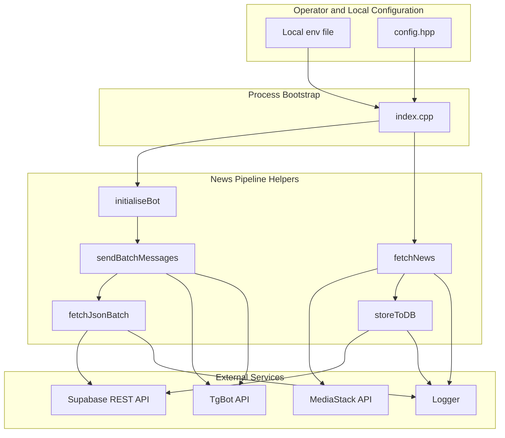
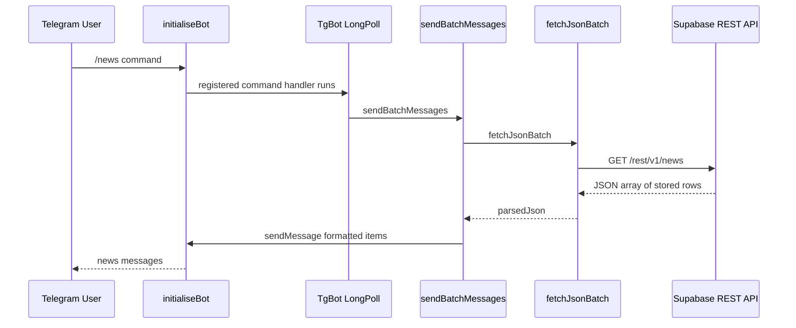

# Repository Intent and Operator-Facing Project Notes

## Overview

This repository presents itself as a Telegram bot for daily news updates. The actual code path in `index.cpp` and  implements a small ELT-style pipeline: it extracts news from MediaStack, stores the raw batch in Supabase, and later delivers the latest stored batch through TgBot command handlers.

The practical operator view is simple: load local secrets, start the bot process, keep it running, and use Telegram commands to fetch or inspect the latest stored news batch. The shown helpers rely on `config.hpp` for API base URLs and on  for a minimal typed news record.

## Repository Intent Versus Code Path

The repository’s outward description is “Telegram bot for daily news updates,” but the concrete runtime is a three-step flow: fetchNews pulls from MediaStack, storeToDB persists the payload to Supabase, and sendBatchMessages reads the latest stored row back out and formats it for Telegram delivery.

The code makes the repository’s intent clearer than the README wording alone:

- `index.cpp` boots the process after loading local secrets.
-  contains the operational pipeline:- `fetchNews` for ingestion from MediaStack
- `storeToDB` for persistence to Supabase
- `fetchJsonBatch` for reading the latest stored batch
- `sendBatchMessages` for Telegram delivery
- `initialiseBot` for command registration and long polling
-  provides a very small data carrier for stored news metadata.

The transformation step is lightweight. The code mostly moves JSON between systems, then reshapes it into Markdown messages for Telegram. The only visible “transformation” is payload wrapping for Supabase and message formatting/truncation before sending.

## Architecture Overview



## Component Structure

### Runtime Bootstrap

*`index.cpp`*

The entrypoint starts the process, loads local secrets, and hands control to the helpers in . Its practical job is to wire the API keys and bot runtime together so the process can stay alive for Telegram long polling.

Operator-facing behavior:

- load secrets from a local `.env`
- use `config.hpp` constants for external API base URLs
- start the Telegram bot loop
- keep the process running continuously

### Utility Functions

*`src/utils.hpp`*

These free functions are the real runtime surface of the repository. They handle ingestion, persistence, retrieval, and Telegram delivery.

| Method | Description | Returns |
| --- | --- | --- |
| `fetchJsonBatch` | Reads the latest stored batch from Supabase and parses the JSON response. | `json` |
| `sendBatchMessages` | Formats the latest stored news batch and sends each item to Telegram. | `bool` |
| `storeToDB` | Persists the MediaStack payload to Supabase with a derived `news_group_name`. | `int` |
| `fetchNews` | Calls MediaStack, parses the response, and stores the batch in Supabase. | `int` |
| `initialiseBot` | Registers `/start` and `/news`, then starts TgBot long polling. | `bool` |


#### `fetchJsonBatch`

This helper targets Supabase directly through `httplib::Client`, using `SUPABASE_API_URL` and the `/rest/v1/news` route. It sends `apikey`, `Authorization`, and `Content-Type` headers, then parses the body as JSON when the HTTP status is `200`.

Behavior:

- creates a `Logger` at `LOG_LEVEL::DEBUG`
- performs a GET request to Supabase
- logs success on parseable `200` responses
- throws on non-`200` responses or missing response objects
- logs JSON parse failures and standard exceptions before rethrowing

#### `sendBatchMessages`

This helper is the Telegram delivery surface. It pulls stored batches via `fetchJsonBatch`, takes the newest row with `parsedJson.back()`, and expects that row to contain a `json` object with a `data` array.

Behavior:

- sends `"No news alerts available at this time."` when the Supabase result is empty or not an array
- sends `"Invalid news data format."` when the last row does not contain a JSON object under `json`
- sends `"No news items in the latest batch."` when `data` is missing or empty
- formats each news item with:- bold title
- truncated description at 500 characters
- `[Read more]` link
- published date
- disables link previews with `TgBot::LinkPreviewOptions`
- retries in plain text if Markdown send fails with `TgBot::TgException`
- sends a final summary message with the number of sent items

#### `storeToDB`

This helper writes the MediaStack response into Supabase.

Behavior:

- parses the incoming JSON body
- extracts the first article title from `data[0].title` when present
- creates a payload with:- `json`
- `news_group_name`
- posts the payload to `/rest/v1/news`
- treats HTTP `200` and `201` as success
- logs JSON parse and standard exceptions, then returns `-1`

#### `fetchNews`

This helper is the ingestion step.

Behavior:

- builds a MediaStack URL with `access_key`
- performs a GET against `MEDIASTACK_API_URL`
- prints the HTTP status to stdout
- parses the response body as JSON
- pretty-prints the JSON and passes it to `storeToDB`
- logs success after the parse step and returns `1`
- logs parse and standard exceptions, then returns `-1`

#### `initialiseBot`

fetchNews does not inspect the return value from storeToDB. If persistence fails but the MediaStack response parsed successfully, fetchNews still logs success and returns 1.

This helper binds the Telegram commands and starts the long-poll loop.

Behavior:

- registers `/start`- replies with `Hi!`
- registers `/news`- replies immediately with `Fetching latest news...`
- calls `sendBatchMessages`
- prints the bot username at startup
- starts `TgBot::TgLongPoll`
- loops forever by repeatedly calling `longPoll.start()`

### Data Model

In the /news handler, chatId is derived from message->chat->id, but sendBatchMessages is called with the captured chatID argument instead. The command acknowledgment goes to the triggering chat, while the news batch is delivered to the configured chat ID passed into initialiseBot.

*`src/newsModel.hpp`*

`NewsModel` is a minimal record type for stored news metadata.

| Property | Type | Description |
| --- | --- | --- |
| `jsonBody` | `std::string` | Raw JSON body for the batch. |
| `newsGroupTitle` | `std::string` | Title derived for the stored news group. |
| `id` | `int` | Numeric record identifier. |


## Telegram Delivery Service

`sendBatchMessages` and `initialiseBot` are the Telegram-facing part of the repository. They use TgBot to register commands, read stored batches, and publish formatted messages back to Telegram.

### Lifecycle

1. `initialiseBot` registers the `/start` and `/news` handlers.
2. `TgBot::TgLongPoll` keeps the process listening for incoming commands.
3. `/news` triggers `sendBatchMessages`.
4. `sendBatchMessages` reads Supabase data, formats each item, and sends messages through `bot.getApi().sendMessage`.

### Message formatting rules implemented in code

- title is bolded with `*...*`
- description is appended only when present and non-empty
- description is truncated to 500 characters
- link uses Markdown format
- published date is appended when available
- link previews are disabled for the Markdown send
- fallback plain text removes `*` and converts Markdown links to `text (url)`

### Sequence of Telegram delivery



## Logging Service

`Logger` is instantiated in the HTTP-facing helpers to record success and failure states.

### Where it is used

| Method | Logging purpose |
| --- | --- |
| `fetchJsonBatch` | Logs successful retrieval and all parse or request failures. |
| `storeToDB` | Logs successful persistence and all parse or request failures. |
| `fetchNews` | Logs successful ingestion and all parse or request failures. |


### Logging behavior in code

- each helper creates `Logger log = Logger("nil", LOG_LEVEL::DEBUG);`
- success messages are updated to `LOG_LEVEL::SUCCESS`
- failures are updated to `LOG_LEVEL::ERROR`
- `log.log()` is called immediately after message updates

The logging surface is operational rather than analytical. It records the status of each external interaction so the bot operator can track ingestion, persistence, and retrieval failures.

## HTTP and API Integration

### MediaStack API

#### Fetch News From MediaStack

```api
{
    "title": "Fetch News From MediaStack",
    "description": "Downloads the latest news payload used as the source batch for persistence.",
    "method": "GET",
    "baseUrl": "<MEDIASTACK_API_URL>",
    "endpoint": "/v1/news?access_key=<mediastack_api_key>",
    "headers": [],
    "queryParams": [
        {
            "key": "access_key",
            "value": "<mediastack_api_key>",
            "required": true
        }
    ],
    "pathParams": [],
    "bodyType": "none",
    "requestBody": "",
    "formData": [],
    "rawBody": "",
    "responses": {
        "200": {
            "description": "Success",
            "body": "{\n    \"data\": [\n        {\n            \"title\": \"Morning Markets Rally\",\n            \"description\": \"Stocks rose after the opening bell as investors reacted to new guidance.\",\n            \"url\": \"https://example.com/news/morning-markets-rally\",\n            \"published_at\": \"2026-04-20T08:30:00+00:00\"\n        }\n    ]\n}"
        }
    }
}
```

### Supabase API

#### Store News Batch In Supabase

```api
{
    "title": "Store News Batch In Supabase",
    "description": "Persists the MediaStack payload as a row with a derived news group title.",
    "method": "POST",
    "baseUrl": "<SUPABASE_API_URL>",
    "endpoint": "/rest/v1/news",
    "headers": [
        {
            "key": "apikey",
            "value": "<supabase_api_key>",
            "required": true
        },
        {
            "key": "Authorization",
            "value": "Bearer <supabase_api_key>",
            "required": true
        },
        {
            "key": "Content-Type",
            "value": "application/json",
            "required": true
        }
    ],
    "queryParams": [],
    "pathParams": [],
    "bodyType": "json",
    "requestBody": "{\n    \"json\": {\n        \"data\": [\n            {\n                \"title\": \"Morning Markets Rally\",\n                \"description\": \"Stocks rose after the opening bell as investors reacted to new guidance.\",\n                \"url\": \"https://example.com/news/morning-markets-rally\",\n                \"published_at\": \"2026-04-20T08:30:00+00:00\"\n            }\n        ]\n    },\n    \"news_group_name\": \"Morning Markets Rally\"\n}",
    "formData": [],
    "rawBody": "",
    "responses": {
        "200": {
            "description": "Success",
            "body": "{\n    \"json\": {\n        \"data\": [\n            {\n                \"title\": \"Morning Markets Rally\",\n                \"description\": \"Stocks rose after the opening bell as investors reacted to new guidance.\",\n                \"url\": \"https://example.com/news/morning-markets-rally\",\n                \"published_at\": \"2026-04-20T08:30:00+00:00\"\n            }\n        ]\n    },\n    \"news_group_name\": \"Morning Markets Rally\"\n}"
        },
        "201": {
            "description": "Created",
            "body": "{\n    \"json\": {\n        \"data\": [\n            {\n                \"title\": \"Morning Markets Rally\",\n                \"description\": \"Stocks rose after the opening bell as investors reacted to new guidance.\",\n                \"url\": \"https://example.com/news/morning-markets-rally\",\n                \"published_at\": \"2026-04-20T08:30:00+00:00\"\n            }\n        ]\n    },\n    \"news_group_name\": \"Morning Markets Rally\"\n}"
        }
    }
}
```

#### Fetch Latest Stored News Batch

```api
{
    "title": "Fetch Latest Stored News Batch",
    "description": "Reads stored rows from Supabase so the latest batch can be delivered through Telegram.",
    "method": "GET",
    "baseUrl": "<SUPABASE_API_URL>",
    "endpoint": "/rest/v1/news",
    "headers": [
        {
            "key": "apikey",
            "value": "<supabase_api_key>",
            "required": true
        },
        {
            "key": "Authorization",
            "value": "Bearer <supabase_api_key>",
            "required": true
        },
        {
            "key": "Content-Type",
            "value": "application/json",
            "required": true
        }
    ],
    "queryParams": [],
    "pathParams": [],
    "bodyType": "none",
    "requestBody": "",
    "formData": [],
    "rawBody": "",
    "responses": {
        "200": {
            "description": "Success",
            "body": "[\n    {\n        \"json\": {\n            \"data\": [\n                {\n                    \"title\": \"Morning Markets Rally\",\n                    \"description\": \"Stocks rose after the opening bell as investors reacted to new guidance.\",\n                    \"url\": \"https://example.com/news/morning-markets-rally\",\n                    \"published_at\": \"2026-04-20T08:30:00+00:00\"\n                }\n            ]\n        },\n        \"news_group_name\": \"Morning Markets Rally\"\n    }\n]"
        }
    }
}
```

## Local Operation Notes

sendBatchMessages selects the latest stored row with parsedJson.back(). The Supabase query must therefore return rows in the order the bot expects, because the code assumes the newest batch is already at the end of the returned array.

- `config.hpp` supplies the base URLs consumed by the HTTP helpers.
- The entrypoint in `index.cpp` is responsible for loading secrets from a local `.env`.
- The runtime is a single long-lived process; `initialiseBot` starts Telegram long polling and keeps it active.
- The bot exposes two command handlers:- `/start` returns a greeting
- `/news` fetches the latest stored batch and sends it to the configured chat target
- The Telegram delivery path relies on the latest persisted Supabase row, not on live MediaStack reads at command time.

## Error Handling

The code uses a narrow, explicit pattern:

- parse errors are caught separately where JSON parsing happens
- standard exceptions are caught and logged
- Telegram send failures in `sendBatchMessages` fall back to plain text
- HTTP request failures throw runtime errors with status and body details where available

### Helper-level behavior

| Method | Failure behavior |
| --- | --- |
| `fetchJsonBatch` | Logs and throws on parse errors, non-`200` responses, or missing responses. |
| `sendBatchMessages` | Sends an error message to Telegram and returns `false` on exceptions. |
| `storeToDB` | Logs the failure and returns `-1` on parse errors or request exceptions. |
| `fetchNews` | Logs the failure and returns `-1` on parse errors or request exceptions. |
| `initialiseBot` | Catches `TgBot::TgException` and `std::exception`, prints the error, and returns `false`. |


## Key Classes Reference

| Class | Responsibility |
| --- | --- |
| `index.cpp` | Boots the process, loads local secrets, and starts the bot runtime. |
|  | Implements MediaStack ingestion, Supabase persistence, and Telegram delivery. |
|  | Defines the minimal news record container used by the repository. |
| `config.hpp` | Provides the API base URL constants consumed by the helper functions. |
| `README.md` | States the repository intent as a Telegram bot for daily news updates. |
